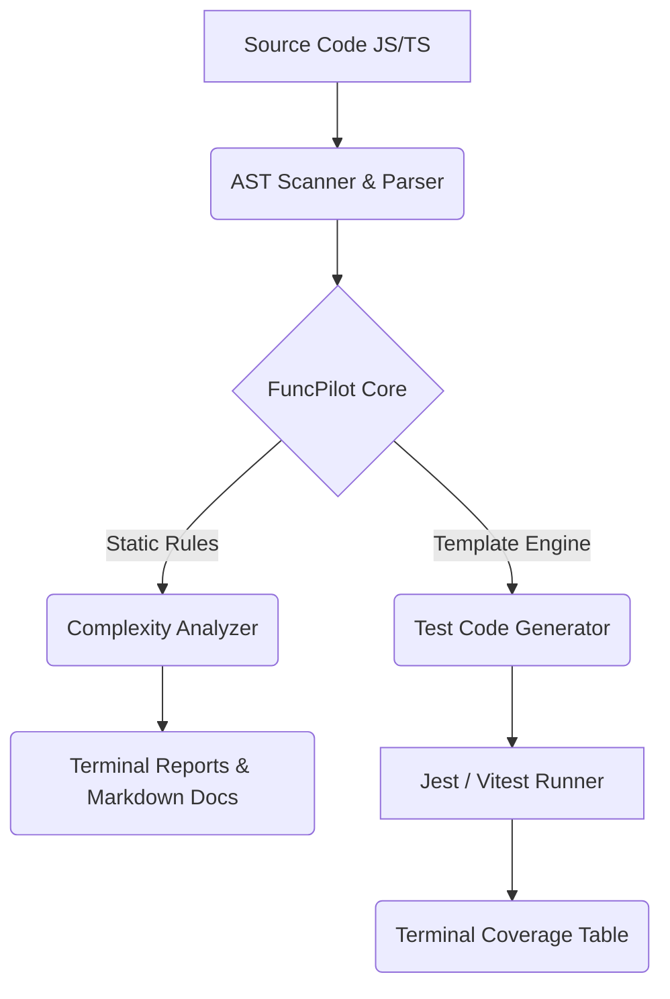

<p align="center">
  
</p>

<h1 align="center">FuncPilot 🚀</h1>

<p align="center">
  <strong>An Intelligent, 100% Offline Unit Testing and Codebase Diagnostics CLI for Modern JavaScript & TypeScript.</strong>
</p>

<p align="center">
  
  
  
  
</p>

---

## ✨ Overview

**FuncPilot** is a professional-grade, local-first CLI tool designed to supercharge your testing and refactoring workflow. It automatically analyzes your codebase structures, diagnoses complexity hotspots, generates high-quality unit test boilerplates (using Jest or Vitest), and runs them dynamically—all in a premium, responsive Terminal dashboard with **zero cloud dependencies, zero AI costs, and absolute privacy**.

> [!IMPORTANT]
> **100% Local Processing:** FuncPilot never uploads your code to external servers. It runs entirely on your local machine using abstract syntax tree (AST) parsing and static analysis heuristics.

---

## 🚀 Key Features

- **⚡ Intelligent Codebase Scanning:** Scans JavaScript/TypeScript files in seconds. Automatically extracts structural information like classes, constructor layouts, methods, async/sync helper functions, and parameters.
- **🔍 Static Complexity & Quality Analysis:** Evaluates structural metrics (like parameter count, function length, and control-flow signatures) to highlight refactoring hotspots and code smell warnings.
- **🛠 Smart Test Template Boilerplate:** Automatically writes isolated test files with pre-configured mocks, assertions, and test structure targeting your selected framework (`jest` or `vitest`).
- **🎯 Interactive Setup Wizard:** A beautiful, terminal-driven wizard (`funcpilot init`) that automatically parses your environment, detects existing frameworks, and sets up your preference file in seconds.
- **📊 Unified Runner & Coverage Dashboard:** Run your entire generated test suite and inspect visual, terminal-based coverage summaries with a single command.
- **📖 Auto-Markdown Docs Generator:** Compiles a complete, clean directory map of all class exports, exported functions, signature definitions, and outstanding code quality flags directly into clean Markdown files under `docs/`.

---

## 🛠 Installation

Install the package globally using `npm` to run it anywhere across your local machine:

```bash
npm install -g funcpilot
```

Alternatively, you can link it locally for development:

```bash
cd Funcpilot
npm run build
npm link
```

---

## 📖 Command Guide

| Command                        | Arguments     | Default | Description                                                                                     |
| :----------------------------- | :------------ | :------ | :---------------------------------------------------------------------------------------------- |
| **`funcpilot`**                | —             | —       | Launches the premium dashboard, checks project configurations, and prints a status welcome.     |
| **`funcpilot init`**           | —             | —       | Starts the Interactive Configuration Wizard to bootstrap your `.funcpilotrc` file.              |
| **`funcpilot scan`**           | `[directory]` | `src`   | Recursively scans a folder and displays discovered classes, exported functions, and signatures. |
| **`funcpilot analyze`**        | `[directory]` | `src`   | Executes deep quality checks on your functions, listing refactoring hints and code smells.      |
| **`funcpilot generate-tests`** | `[directory]` | `src`   | Generates robust Jest or Vitest template files inside your chosen output folder.                |
| **`funcpilot run`**            | —             | —       | Automatically compiles and runs all test suites under the configured directory.                 |
| **`funcpilot coverage`**       | —             | —       | Triggers testing with coverage flags enabled, mapping a beautiful terminal status table.        |
| **`funcpilot docs`**           | —             | —       | Compiles directory exports and code quality metrics into an active `/docs/CODEBASE.md` map.     |

---

## ⚙️ Configuration (`.funcpilotrc`)

When initializing your project using `funcpilot init`, the CLI generates a `.funcpilotrc` file in your root folder. This file tracks testing variables:

```json
{
  "testFramework": "jest",
  "outputDirectory": "tests/generated",
  "autoRunTests": false,
  "ignoredFolders": ["node_modules", "dist", ".git"]
}
```

### Config Options:

- `testFramework`: Choose between `"jest"` and `"vitest"`.
- `outputDirectory`: Relative path where generated tests are saved (defaults to `tests/generated`).
- `autoRunTests`: Automatically run test runners instantly upon code generation.
- `ignoredFolders`: Folders completely excluded during recursive parsing.

---

## 🏁 Quick Start Workflow

Follow these simple steps to run diagnostics and generate testing scripts for a brand new project:

### Step 1: Initialize the setup

Run the interactive setup. FuncPilot will auto-detect your project settings:

```bash
funcpilot init
```

_Output Preview:_

```text
🚀 FuncPilot Setup Wizard

Detected: my-awesome-app with jest and TypeScript

? Select test framework: (Use arrow keys)
❯ jest
  vitest
? Where should generated tests be stored? tests/generated
? Enable auto-run tests? No

✔ Project initialized successfully!
Created .funcpilotrc and tests/generated/ folder.
```

### Step 2: Run Codebase Scanner

Scan exports, method signatures, and structure details inside your folder:

```bash
funcpilot scan src/
```

### Step 3: Analyze Complexity & Issues

Diagnose potential bugs, over-long functions, or complex methods before writing code:

```bash
funcpilot analyze src/
```

_Output Preview:_

```text
✔ Analysis complete.

⚠ Function "processLargeDataset" in src/services/data.ts
  Issue: Function is too long
  Suggestion: Consider breaking it down into smaller, more manageable functions.

Found 1 issue.
```

### Step 4: Generate Unit Test Suites

Generate complete, mock-configured, ready-to-fill spec templates inside `tests/generated/`:

```bash
funcpilot generate-tests src/
```

### Step 5: Execute Tests & Generate Reports

Run and inspect tests using your pre-set testing framework:

```bash
funcpilot run
funcpilot coverage
```

### Step 6: Generate Codebase Documentation

Compile a comprehensive index of exports, complexity warnings, and code architecture maps:

```bash
funcpilot docs
```

This generates a detailed `docs/CODEBASE.md` that keeps your team synchronized on function signatures and refactoring checklists!

---

## ⚡ Technical Architecture

FuncPilot leverages a highly modular and extensible system:



1.  **Scanner & AST Parser:** Employs `@babel/parser`, `@babel/traverse`, and `ts-morph` to recursively evaluate project exports, classes, parameters, and async behaviors.
2.  **Complexity Rules Engine:** Evaluates control flow structures, statement length, and signature weight to recommend code-quality refactorings.
3.  **Code Generator:** Uses custom, format-aware templates (`src/templates/`) to safely write standard-compliant spec files with ready-to-run setup code.
4.  **Test Execution Hub:** Uses `execa` to seamlessly launch isolated background child processes for `jest` or `vitest` without clobbering your shell history.

---

## 🤝 Contributing

We welcome contributions to make local code testing faster and more visual!

1.  Fork the repository
2.  Create your feature branch (`git checkout -b feature/cool-stuff`)
3.  Commit your changes (`git commit -m 'Add some cool features'`)
4.  Push to the branch (`git push origin feature/cool-stuff`)
5.  Open a Pull Request

---

_Built with ❤️ for developers who value speed, privacy, and flawless terminal UX._
